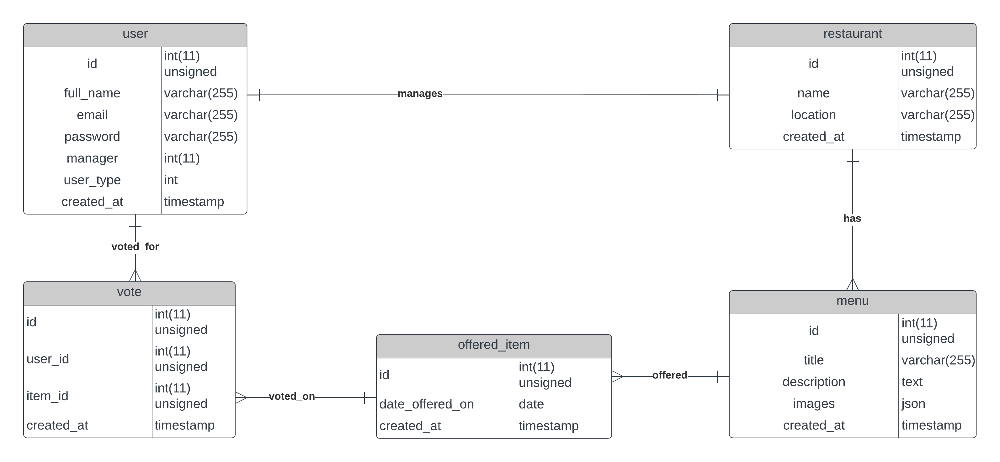

# Launch Instructions

1. Install Python 3.10
2. Open terminal and enter `pip install -r requirements.txt` to install necessary libraries. You should do this on a virtual environment although that is not mandatory.
3. Enter proper database configuration in `settings.py`.
4. Run migrations with `python manage.py makemigrations` and `python manage.py migrate`.
5. Run development server with `python manage.py runserver`

# Short Description

There are 3 types of Users. Employees, Managers (for restaurant) and Others. There is only one manager per Restaurant. Only employees can vote.
When the vote for the day needs to be closed, the Superuser with send a get request to `votes/select_todays_winner/`. It will close the votes and save the highest voted menu as the Winner for the day.
User and Restaurant account will be manually created by the Supersuser.

# Entity Relationship Diagram

# API Doc

| Endpoint                                          | Action             | Description                           | Permission                                           |
| ------------------------------------------------- | ------------------ | ------------------------------------- | ---------------------------------------------------- |
| admin                                             |                    | The django admin panel                | Superuser                                            |
| accounts/auth/token/                              | POST               | send email and password to get token  | Authenticated                                        |
| accounts/auth/token/refresh/                      | POST               | send email and password to get token  | Authenticated                                        |
| accounts/users/                                   | GET,POST           | GET: list all users POST: create user | Superuser                                            |
| accounts/users/\<int:pk>/                         | GET,POST,PUT,PATCH | CRUD on a single user                 | Superuser or Self                                    |
| restaurants/                                      | GET,POST           | GET: list all POST: create            | Superuser can create else Authenticated              |
| restaurants/\<int:pk>/                            | GET,POST,PUT,PATCH | CRUD on a single restaurant           | Superuser or restaurant Manager                      |
| restaurants/\<int:rpk>/menu/                      | GET,POST           | GET: list all POST: create            | Authenticated                                        |
| restaurants/menu/\<int:pk>/                       | GET,POST,PUT,PATCH | CRUD on a single menu                 | Superuser or restaurant Manager                      |
| restaurants/menu/\<int:menu_pk>/offers/           | GET,POST           | GET: list all POST: create            | Authenticated                                        |
| restaurants/menu/\<int:menu_pk>/offers/\<int:pk>/ | GET,POST,PUT,PATCH | CRUD on a single offer item           | Superuser or Manager                                 |
| votes/                                            | GET,POST           | GET: list all POST: create            | Superuser can see all votes, Employees can only vote |
| votes/current_standings/                          | GET                | See today's top 3 voted menu          | Authenticated                                        |
| votes/<int:pk>/                                   | GET,POST,PUT,PATCH | CRUD on a single vote                 | Superuser or Self                                    |
| votes/select_todays_winner/                       | GET                | Finalize today's winner               | Superuser                                            |

# Improvement needed

1. I haven't been able to rigorously test each endpoint for authorization, thus there is a possiblity of unseen behaviours in this case.
2. Few other API needed to be created. For example - Getting winners from different days etc.
